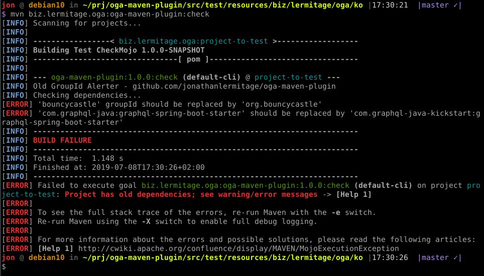

<h1 align="center">
    Old GroupIds Alerter - Maven Plugin
</h1>

<p align="center">
    <a href="https://travis-ci.org/jonathanlermitage/oga-maven-plugin"></a>
    <a href="https://github.com/jonathanlermitage/oga-maven-plugin/blob/master/LICENSE.txt"></a>
    <a href="https://oss.sonatype.org/#nexus-search;quick~oga-maven-plugin"></a>
</p>

A Maven plugin that checks for deprecated *groupId + artifactId* couples, in order to reduce usage of non-maintained 3rd-party code (e.g. did you know that artifact `graphql-spring-boot-starter` moved from `from com.graphql-java` to `com.graphql-java-kickstart`?).

Works with Maven 3.3+ and JDK8+.

## Author

Jonathan Lermitage (<jonathan.lermitage@gmail.com>)  
Linkedin profile: [jonathan-lermitage-092711142](https://www.linkedin.com/in/jonathan-lermitage-092711142/)

## Usage

### Goal

There's one maven goal: `biz.lermitage.oga:oga-maven-plugin:check`.

Execution will produce error  message everytime a deprecated *groupId + artifactId* couple is found.  
You may see something like `[ERROR] 'com.graphql-java:graphql-spring-boot-starter' should be replaced by 'com.graphql-java-kickstart:graphql-spring-boot-starter'`, and Maven build failure.



### Maven coordinates

Maven coordinates ([Nexus](https://oss.sonatype.org/#nexus-search;quick~oga-maven-plugin), [Ticket](https://issues.sonatype.org/browse/OSSRH-49767)):

```xml
<groupId>biz.lermitage.oga</groupId>
<artifactId>oga-maven-plugin</artifactId>
<version>1.0.0</version>
```

## Build

Just call `./mvnw clean install` or `./do i` to build plugin and install into local Maven repository.  

## Contribution

### Code 

Open an issue or a pull-request. Contributions must be tested at least on JDK8.  
Please reformat new code only: do not reformat the whole project or entire existing file (in other words, try do limit the amount of changes in order to speed up code review).

### Definitions file

The list of deprecated *groupId + artifactId* couples is stored in [og-definitions.json](uc/og-definitions.json) file. To remove/update/add entries, you can open an issue, submit a merge request, or simply send an email (<jonathan.lermitage@gmail.com>).  

### Find new entries for definitions file

Go to [maven-index-search-suspect-coordinates](maven-index-search-suspect-coordinates/): this project downloads Maven Central indexes and looks for potential entries, then saves it to a file; i.e. artifactIds that exists for two different groupIds (keep in mind that 90~99% are false-positive).  
You can view resulting file here: [suspiciousCoordinates.txt](maven-index-search-suspect-coordinates/suspiciousCoordinates.txt) (warning, it's a ~3 MB file).  
A filtered version is available here: [suspiciousCoordinates-filtered.txt](maven-index-search-suspect-coordinates/suspiciousCoordinates-filtered.txt) (~500 KB). In this file, we keep only dependency couples where a groupId is a part of the other groupdId, like `com.graphql-java` and `com.graphql-java-kickstart`.

## License

MIT License. In other words, you can do what you want: this project is entirely OpenSource, Free and Gratis.
